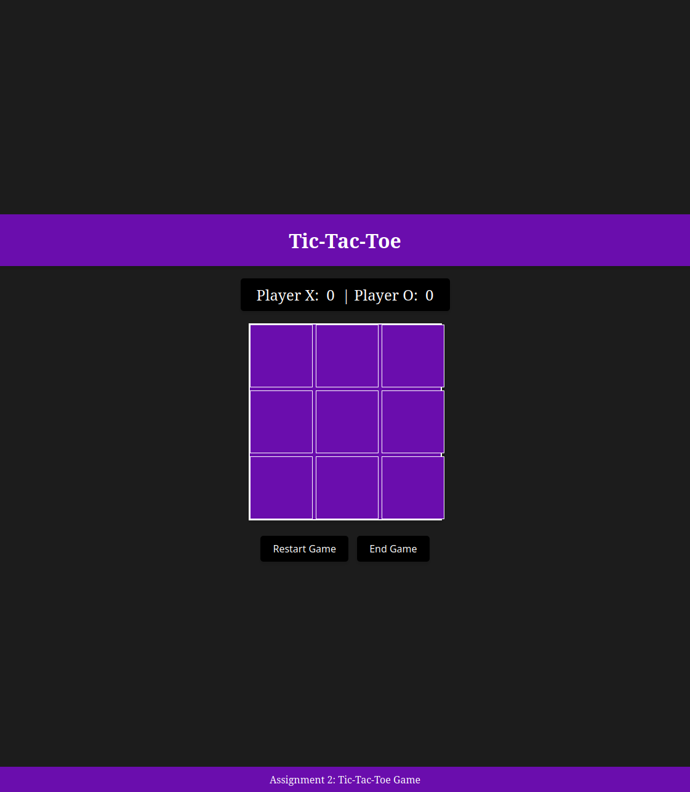
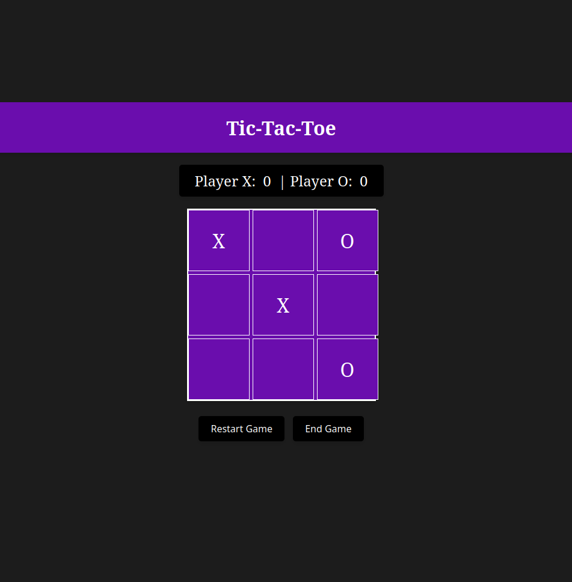
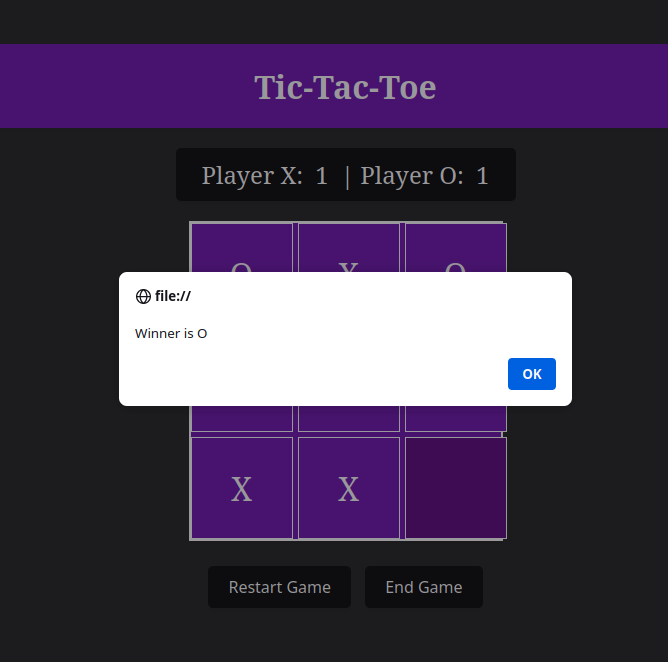

# Tic-Tac-Toe

## Overview

This project is an implemenation of Tic-Tac-Toe using Javascript for the logic, and HTML and CSS for the styling of the website. We incorporated PHP to save info of users and their score and view this leaderboard with HTML. 

## Design

The document [design_system](./docs/design_system.md) in the docs section covers the design methodology of this project.


## Usage

To play the game, users must first download the repository by entering the following commands:

```
git clone https://github.com/nimishaayappa/Tic-Tac-Toe.git
```

To play the game, visit this url in a browser of the user's choice. The path must be replaced with whichever directory the user has cloned the repository into.

```file:///home/path/to/repo/Tic-Tac-Toe/index.html```


### Gameplay


#### Initial Screen



#### Gameplay Example



#### O Victory


#### Leaderboard

